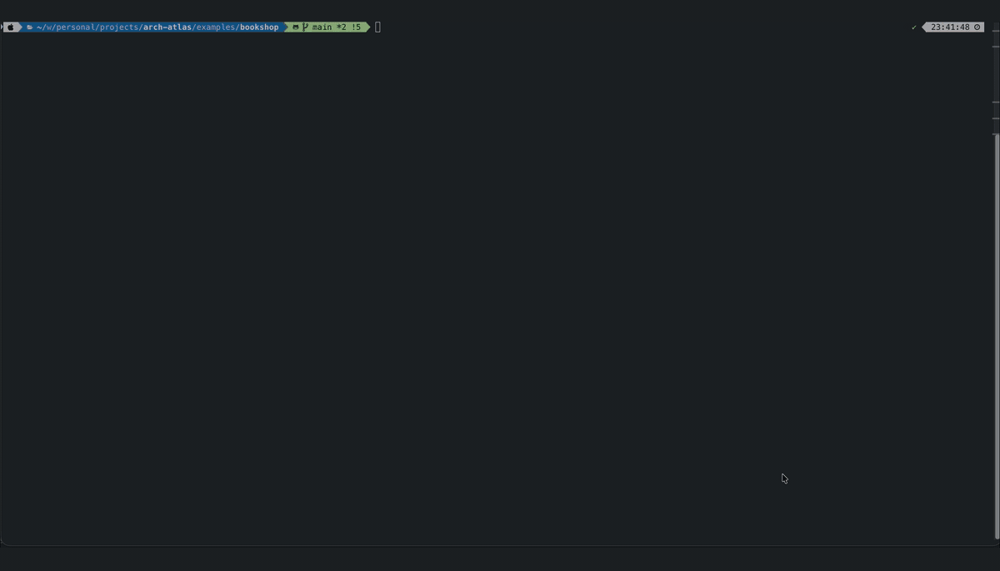

# Arch Atlas

Web-based tooling for building and evolving **C4 architecture** models and diagrams.

## What this repo is

An open source monorepo with three apps and a set of static-analysis producers that feed them:

- **Studio** — the visual editor: create, edit, and save C4 diagrams (local disk or Google Drive).
- **Viewer** — a standalone, read-only diagram viewer deployable to any static web server (no auth, no server).
- **LLM Importer** — a deterministic CLI that turns a multi-repository workspace into a diagram Studio can import, from per-repository analysis artifacts produced by a swappable set of **skills/plugins**.

The importer itself makes no model call and never talks to a model — local or hosted — under
any configuration. Turning a repository into an analysis artifact is a separate, swappable step
performed by a producer such as `plugins/repo-analysis`, which runs from an `AGENTS.md`
(https://agents.md) so it works with any coding agent — Claude Code, Cursor, Copilot, Codex,
Windsurf, and 20+ others. Which model does the actual analysis (a local endpoint or a hosted
API) is entirely up to whichever agent you point at it; anyone can also write their own producer
against the same contract.

**Status:** early stage / under active development.

## Use Arch Atlas

Everything below works without building this repo — Studio is already hosted, and the importer
runs straight from npm. (Extending or developing Arch Atlas itself is a separate path, covered
under [Development](#development).)

### Studio — the diagram editor

Open [**arch-atlas-studio.vercel.app**](https://arch-atlas-studio.vercel.app) — nothing to
install. Create and edit C4 diagrams, saving to Google Drive (sign-in required) or your local
disk (no auth needed).

### Import a multi-repo workspace into a diagram

1. Write an `import.yaml` listing your repositories (see
   [`apps/llm-importer/README.md`](apps/llm-importer/README.md) for the format).
2. Set up your coding agent — from the workspace that holds `import.yaml`:

   ```bash
   npx --yes @archatlas/llm-importer@latest init --agent cursor   # claude | copilot | cursor | codex | generic
   ```

   This installs the analysis procedure where your agent looks for it — a skill for Claude Code,
   Cursor and Copilot (each invoked as `/arch-atlas-import`), or a block in `AGENTS.md` for Codex,
   Windsurf, Gemini CLI and the rest. Full table:
   [`plugins/repo-analysis/README.md`](plugins/repo-analysis/README.md#install-for-your-agent).

3. Ask your agent to import the workspace. It analyzes each repository, then runs the importer
   itself (`npx @archatlas/llm-importer@latest import import.yaml`) — fully deterministic, no
   model call — producing `architecture.review.yaml`.
4. Upload that file into [Studio's import wizard](https://arch-atlas-studio.vercel.app/import) to
   review the proposed connections and build the diagram.

See [`apps/llm-importer/README.md`](apps/llm-importer/README.md) for the full CLI reference and
the producer contract behind step 2–3.

### Try it: the Bookshop demo

[`examples/bookshop`](examples/bookshop) is a small workspace to try the whole loop on — five
services in Go, Java, TypeScript and Python that talk over HTTP and Kafka and call out to
Keycloak, Stripe, Amazon S3 and SendGrid. Its analyses are committed, so the importer runs
**offline, with no model and no coding agent**:

```bash
git clone https://github.com/pavanandhukuri/arch-atlas.git && cd arch-atlas/examples/bookshop
npx --yes @archatlas/llm-importer@latest import import.yaml   # → architecture-output/architecture.review.yaml
```

Then open the hosted Studio at [arch-atlas-studio.vercel.app/import](https://arch-atlas-studio.vercel.app/import),
upload `architecture.review.yaml`, and confirm the proposed connections. The system grouping is
pre-filled from `import.yaml`, high-confidence connections are pre-accepted, and each proposal
shows the evidence behind it.



_A coding agent analyzes the five repos and runs the importer; the result is reviewed and finalized in Studio._

See [`examples/bookshop/README.md`](examples/bookshop/README.md) for the architecture it
implements, a click-by-click Studio walkthrough, and how to regenerate the analyses with your own
coding agent.

### Viewer — sharing a diagram read-only

The Viewer is a static site you deploy yourself (nginx, S3, any static host) to show finished
`.arch.json` diagrams with no auth and no server. There's no hosted instance to point at, since
it serves _your_ diagrams — building and deploying one is covered under
[Development → Viewer](#viewer-standalone-static-viewer).

## Development

Building, extending, or contributing to Arch Atlas itself.

### Prerequisites

- Node.js ≥ 20 (LTS) for `apps/studio` / `apps/viewer`; Node.js ≥ 22 for `apps/llm-importer`
- pnpm ≥ 8

### Install

```bash
git clone https://github.com/pavanandhukuri/arch-atlas.git
cd arch-atlas
pnpm install
```

### Repository structure

```
apps/
  studio/          — Next.js visual C4 diagram editor (create, edit, save to Google Drive or local disk)
  llm-importer/    — Deterministic CLI: correlates per-repo analysis artifacts into a diagram Studio can import
  viewer/          — Standalone static viewer (read-only, nginx-deployable, no auth required)

packages/
  core-model/         — Canonical architecture model types, validation, and diff/patch
  model-schema/       — JSON schemas for exported .arch.json files
  layout/             — Deterministic layout engine
  renderer/           — PixiJS WebGL rendering engine (no React dependency)
  viewer-components/  — React components shared by Studio and Viewer (MapCanvas, DiagramViewer, ZoomControls, useZoom)

examples/
  bookshop/           — A five-service polyglot demo workspace (Go, Java, TypeScript, Python) with an
                        import.yaml and committed analyses: try the importer and Studio end to end

plugins/
  repo-analysis/      — The repo-analysis producer: reads one repository (or its context bundle)
                        and writes {repo}.analysis.json. Canonical procedure is a skill
                        (plugins/repo-analysis/skills/import/SKILL.md; AGENTS.md is generated
                        from it), installed into a workspace via `archatlas init`. Run it against
                        a local or hosted model — your choice, the importer has no opinion.
```

#### How a multi-repo workspace becomes a diagram

```
point a coding agent at import.yaml (after `archatlas init`) — one request runs the whole
pipeline itself:
  gather-context (per repo)     → {repo}.context.json      (bounded, deterministic, secrets excluded)
  analyze each bundle           → {repo}.analysis.json      (the one step touching a model — your
                                                              agent, your model, local or hosted)
  import (correlate)            → deterministic evidence passes over the raw source
                                   (manifests, HTTP routes, gRPC, schemas, compose files, pub/sub topics)
                                 → architecture.review.yaml

Studio's import wizard reads architecture.review.yaml and lets a human confirm/classify
elements before building the diagram.
```

`gather-context` and `import` are still directly callable on their own if a producer wants to
invoke them itself instead. See `apps/llm-importer/README.md` for the full pipeline and CLI
reference, and `specs/010-harness-neutral-importer/` for the producer contract new producers
implement against.

#### Package dependency hierarchy (editor/viewer stack)

```
@archatlas/core-model
@archatlas/layout
        ↓
@archatlas/renderer          (PixiJS engine, no React)
        ↓
@archatlas/viewer-components (React: MapCanvas, DiagramViewer, ZoomControls, useZoom)
        ↓                ↓
  apps/studio       apps/viewer
```

`apps/studio` and `apps/viewer` both import from `@archatlas/viewer-components` — the single source of truth for the rendering stack. Neither app duplicates diagram rendering code.

### Running the apps locally

#### Studio (diagram editor)

```bash
cd apps/studio
pnpm dev
```

Opens at `http://localhost:3000`.

#### LLM Importer (from source)

To try a change to the importer itself without publishing:

```bash
cd apps/llm-importer
pnpm exec tsx src/cli.ts import <config>          # equivalent to the published `archatlas import <config>`
pnpm exec tsx src/cli.ts init --agent claude      # equivalent to `archatlas init --agent claude`
```

#### Viewer (standalone static viewer)

The viewer loads pre-bundled `.arch.json` files with no auth required.

**Development mode:**

```bash
cd apps/viewer
pnpm dev
```

Opens at `http://localhost:5173`.

**Production build (for nginx / static hosting):**

```bash
cd apps/viewer
pnpm build          # outputs to apps/viewer/dist/
```

Deploy `dist/` to any static web server. To add diagrams, place `.arch.json` files in `dist/diagrams/` and update `dist/diagrams/manifest.json`:

```json
[{ "id": "my-diagram", "title": "My Architecture", "file": "my-diagram.arch.json" }]
```

No rebuild required — adding entries to `manifest.json` is enough.

### Development workflow

1. **Make changes** in the appropriate `apps/*` or `packages/*` directory
2. **Write tests first** — TDD is required; confirm tests fail before implementing
3. **Implement** the feature or fix
4. **Run tests**: `pnpm run test` (coverage must be ≥ 80%)
5. **Lint**: `pnpm run lint`
6. **Commit** and open a PR

### Running tests

```bash
# All packages and apps
pnpm run test

# Specific app
cd apps/studio && pnpm test
cd apps/viewer && pnpm test
cd apps/llm-importer && pnpm test

# Specific package
cd packages/renderer && pnpm test
```

### Building packages

```bash
pnpm run build
```

## Contributing

See `CONTRIBUTING.md`.

## Security

See `SECURITY.md`.

## License

See `LICENSE`.
