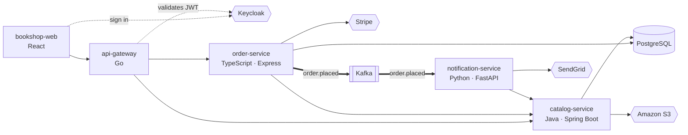

# Bookshop — a demo workspace

Five small services in five languages, written so the importer has something real to find: HTTP
routes, a Kafka event, a database, and calls out to Keycloak, Stripe, Amazon S3 and SendGrid.
It is what the [main README](../../README.md#try-it-the-bookshop-demo) walks through, and it is
also the importer's [eval golden set](../../apps/llm-importer/eval/README.md) — the benchmark for
correlation quality, not a throwaway fixture.



_This is the architecture the sample code implements — what a correct import should recover._

| Repo                                                 | Language             | What it does                                                    |
| ---------------------------------------------------- | -------------------- | --------------------------------------------------------------- |
| [`bookshop-web`](repos/bookshop-web)                 | TypeScript · React   | Storefront; signs in with Keycloak, talks only to the gateway   |
| [`api-gateway`](repos/api-gateway)                   | Go                   | Validates Keycloak JWTs, proxies `/api/books` and `/api/orders` |
| [`catalog-service`](repos/catalog-service)           | Java · Spring Boot   | Book catalogue in PostgreSQL, cover images in S3                |
| [`order-service`](repos/order-service)               | TypeScript · Express | Prices, charges (Stripe), stores, then publishes `order.placed` |
| [`notification-service`](repos/notification-service) | Python · FastAPI     | Consumes `order.placed`, emails the customer via SendGrid       |

## Run it

From this directory (the repository paths in [`import.yaml`](import.yaml) are relative to where
you run it). Needs Node ≥ 22 and nothing else — **no model, no coding agent, no network** beyond
downloading the package:

```bash
cd examples/bookshop
npx --yes @archatlas/llm-importer@latest import import.yaml
```

```
[load] bookshop-web: TypeScript / React
[load] api-gateway: Go
[load] catalog-service: Java / Spring Boot
[load] order-service: TypeScript / Express
[load] notification-service: Python / FastAPI

Correlating across 5 repositories...
    endpoint: 3 connection(s)
    compose: 3 connection(s)
    topic: 1 connection(s)
    external-systems: 6 connection(s)
  Deterministic pass: 18 connection(s) found

✓ Review artifact written to …/architecture-output/architecture.review.yaml
```

That works offline because [`architecture-output/`](architecture-output) already holds each
repo's `{repo}.analysis.json` — the one step that needs a model, produced once by a coding agent
following [`plugins/repo-analysis/AGENTS.md`](../../plugins/repo-analysis/AGENTS.md). The importer
reads the source in `repos/` itself for the deterministic evidence (route and topic literals,
manifests, compose files).

### Regenerate the analyses yourself

Point any coding agent (Claude Code, Cursor, Copilot, Codex, …) running the `repo-analysis`
procedure at [`import.yaml`](import.yaml) and ask it to import the workspace. With Claude Code:

```
/plugin marketplace add pavanandhukuri/arch-atlas
/plugin install repo-analysis@archatlas
/repo-analysis:import import.yaml
```

It analyses each repo, overwrites `architecture-output/*.analysis.json`, and runs `import` for you.

## View it in Studio

`import` writes only `architecture.review.yaml` — a list of _proposed_ connections with a
confidence and the evidence behind each. A person confirms them in Studio, which then builds the
diagram. Open the hosted Studio at
[arch-atlas-studio.vercel.app/import](https://arch-atlas-studio.vercel.app/import) — nothing to
install. To run it locally instead:

```bash
# from the repository root
pnpm install
pnpm --filter @archatlas/studio dev          # http://localhost:3000/import
```

1. **Load Files** — upload `examples/bookshop/architecture-output/architecture.review.yaml`.
2. **Define Systems** — **Bookshop** is already there with all five repos: `import.yaml` declared it.
3. **Tag & Classify** — each service shows its technology (`Java / Spring Boot`, `Go`, …) and a
   one-line description. Mark Keycloak, Stripe, SendGrid, Amazon S3, PostgreSQL and Kafka as
   external systems.
4. **Review Candidates** — the 5 `high`-confidence connections (of 18) are already accepted; the
   other 13 are `medium` — every proposal about an external system is capped there on purpose,
   since it comes from the analysis rather than from literal evidence in the source. Each card
   shows what produced it (for example `api-gateway/main.go:59 references /api/books matching
catalog-service's route`). Accept the rest with one click each — there are no false positives
   to reject: the storefront's proposals stop at the gateway, not the backends behind it, exactly
   like the code.
5. **Finalize** → open the **Bookshop** system context: the five services inside the boundary,
   the external systems above and below, each arrow labelled with what it does and how (REST API,
   Kafka, SQL).

## Recording script

A ~2 minute recording that shows the whole loop. Use a clean terminal and a browser at 1440×900.

| #   | Where    | Do                                                                                         | Show                                                                                                          |
| --- | -------- | ------------------------------------------------------------------------------------------ | ------------------------------------------------------------------------------------------------------------- |
| 1   | Terminal | `cd examples/bookshop && ls repos architecture-output`                                     | Five repos, five languages; the committed analyses                                                            |
| 2   | Terminal | `npx --yes @archatlas/llm-importer@latest import import.yaml`                              | The passes finding connections; `18 connection(s) found`; the written file                                    |
| 3   | Browser  | Open `arch-atlas-studio.vercel.app/import` (or `localhost:3000/import` if running locally) | —                                                                                                             |
| 4   | Browser  | Upload `architecture.review.yaml`                                                          | Load Files                                                                                                    |
| 5   | Browser  | Next: **Define Systems**                                                                   | "Bookshop" pre-filled — declared in `import.yaml`                                                             |
| 6   | Browser  | Next: **Tag & Classify**, click ✏️ on `catalog-service`                                    | Technology + description pre-filled; mark Keycloak/Stripe/S3… external                                        |
| 7   | Browser  | Next: **Review Candidates**                                                                | 5 of 18 already accepted; open a card to show its evidence, then accept the `medium` ones — no rejects needed |
| 8   | Browser  | **Finalize**, open the system context                                                      | Externals above/below, labelled arrows                                                                        |
| 9   | Browser  | Drag a box, pinch/scroll to zoom, ⌘0 to fit                                                | It stays where you put it                                                                                     |

Tips: pause ~1s on steps 2, 7 and 8; keep the cursor still while a page loads. The published
recording is [`docs/media/bookshop-demo.gif`](../../docs/media/bookshop-demo.gif) (shown in the root
README); to replace it, export a GIF (≤ 10 MB) and overwrite that file.
